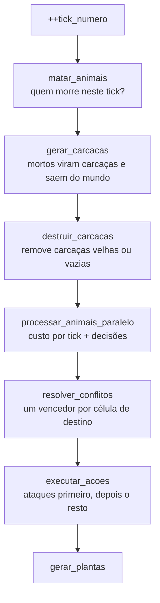

# Arquitetura

Este documento explica como o código está organizado, como o tempo avança, como um tick é processado e como o processamento paralelo mantém a simulação determinística. Para as regras do ecossistema em si, veja [REGRAS.md](REGRAS.md).

## Camadas


O projeto é dividido em quatro pastas, e as dependências sempre apontam para baixo:

| Camada | Pasta | Responsabilidade | Depende de |
|---|---|---|---|
| Aplicação | `aplicacao/` | Loop principal: junta a simulação e a interface e controla o tempo | Simulação, Interface |
| Interface | `interface/` | Janela SFML, eventos de teclado e desenho da grade | Domínio, SFML |
| Simulação | `simulacao/` | Regras do tick: quem morre, quem decide o quê, conflitos e execução | Domínio |
| Domínio | `dominio/` | Estado do mundo e tipos básicos, sem regras de comportamento | Nada (só a biblioteca padrão) |

O domínio não conhece o SFML nem a simulação, e a simulação não conhece o SFML. Isso permite, por exemplo, rodar a simulação sem janela (para testes ou medições) instanciando apenas `Simulacao` e chamando `tempo_avancar`.

## Principais classes

| Classe ou estrutura | Arquivo | Papel |
|---|---|---|
| `Aplicacao` | `aplicacao/Aplicacao.h` | Cria a `Simulacao` e a `Interface` e roda o loop até a janela fechar. |
| `Interface` | `interface/Interface.h` | Processa eventos (fechar, Esc) e desenha cada célula com a cor do que ela contém. |
| `Simulacao` | `simulacao/Simulacao.h` | Dona do `Mundo`. Acumula tempo, executa os ticks e aplica todas as regras. |
| `SistemaDecisao` | `simulacao/SistemaDecisao.h` | Função pura (`const`) que recebe um animal e o que ele vê e devolve uma `Acao`. |
| `Mundo` | `dominio/Mundo.h` | Guarda o `Tabuleiro`, os animais e as carcaças (em `std::unordered_map` por id). Oferece operações de alto nível: adicionar, mover, remover e observar. |
| `Tabuleiro` | `dominio/Tabuleiro.h` | Grade de `Celula`. Normaliza posições para a grade toroidal. |
| `Celula` | `dominio/Celula.h` | Conteúdo de uma posição: planta (sim/não), id da carcaça e id do animal. |
| `Animal`, `Carcaca` | `dominio/Animal.h` | Dados de cada ser: id, espécie, posição, energia, nascimento. |
| `VisaoAnimal`, `CelulaObservada` | `dominio/SistemaVisao.h` | O que um animal enxerga, com posições absolutas e relativas. |
| `Acao`, `Posicao`, `Especie`, `Vec2` | `dominio/Tipos.h` | Tipos básicos e constantes de balanceamento. |

As células guardam **ids**, e os objetos ficam nos mapas do `Mundo`. Por isso existe a cor magenta na interface: ela indica uma célula cujo id não corresponde a nenhum animal ou carcaça, o que seria um bug de sincronização entre a grade e os mapas.

## Controle de tempo

`Aplicacao::executar` roda um loop com três passos por quadro:

1. `interface.processar_eventos()` trata fechar a janela e a tecla Esc.
2. Mede quanto tempo real passou desde o quadro anterior e chama `simulacao.tempo_avancar(tempo)`.
3. `interface.desenhar(mundo)` redesenha a grade inteira.

`Simulacao::tempo_avancar` usa o padrão de **passo fixo com acumulador**:

```cpp
tempo_acumulado += tempo_passado;          // limitado a 1 s por quadro
while (tempo_acumulado >= tick_duracao) {  // tick_duracao = 0,1 s
    tick_atualizar();
    tempo_acumulado -= tick_duracao;
}
```

Cada tick sempre representa exatamente 0,1 s de tempo simulado, independentemente da velocidade do computador ou da taxa de quadros. Isso tem duas consequências:

- **O resultado da simulação não depende do desempenho.** Um computador lento e um rápido produzem a mesma sequência de ticks.
- **Se um tick demorar mais que 0,1 s para ser calculado**, a simulação passa a rodar em câmera lenta. O limite de 1 s por quadro impede que o atraso cresça sem parar, mas permite até 10 ticks seguidos sem redesenhar a tela nem tratar eventos, e a janela fica pouco responsiva.

## Ciclo de um tick

`Simulacao::tick_atualizar` executa as etapas abaixo, sempre nesta ordem:



O ponto central do desenho é a separação entre **decidir** e **agir**. Na etapa de decisão, nenhum animal altera o mundo: cada um produz uma `Acao` (tipo, id do animal e destino). Só depois que todas as decisões estão prontas é que os conflitos são resolvidos e as ações aplicadas. Assim, todos os animais decidem com base no mesmo retrato do mundo, e a ordem em que são processados não importa.

### Da visão à ação

Para cada animal vivo:

1. `Mundo::observar(posicao, raio)` monta uma `VisaoAnimal` com todas as células dentro do círculo de visão. Cada `CelulaObservada` traz a posição absoluta (já normalizada na grade toroidal), a posição relativa ao animal, a distância ao quadrado e o que há na célula.
2. `SistemaDecisao::decidir(animal, visao, gerador, tick)` escolhe a ação. A movimentação usa um campo de forças: cada coisa vista contribui com um vetor proporcional a 1/distância², e o animal vai para a célula vizinha cuja direção forma o menor ângulo com a soma (`direcao_mais_proxima_vetor_direcao`).

### Resolução de conflitos

`resolver_conflitos` agrupa as ações pela célula de destino (num `std::map` ordenado por linha e coluna) e escolhe o que executar em cada grupo:

- ações **Matar** vão para o início da fila de execução;
- **Esperar** e **Comer** são aprovadas diretamente;
- entre **Mover** e **Reproduzir** para a mesma célula, vence o animal de maior energia, e um empate cancela.

## Paralelismo e determinismo

A decisão de cada animal é a parte mais cara do tick, principalmente `observar`, cujo custo cresce com o quadrado do raio de visão. Como as decisões não alteram o mundo, elas podem ser calculadas em paralelo. `processar_animais_paralelo` faz isso em duas fases:

1. **Fase de escrita (sequencial).** Monta uma lista de ponteiros para os animais vivos e desconta de cada um o custo de energia por tick.
2. **Fase de leitura (paralela).** Para cada animal, chama `observar` e `decidir` e grava o resultado em `acoes[i]`, uma posição do vetor exclusiva daquele animal.

Separar as fases garante que nenhuma thread lê a energia de um animal enquanto outra a modifica.

### `paralelo_para`

Função auxiliar em `Simulacao.h` que executa `f(0)` até `f(n-1)`:

- se `n` é menor que `LIMIAR_PARALELO` (400), roda tudo na thread atual, porque com poucos animais criar threads custa mais do que se ganha;
- caso contrário, divide os índices em blocos contíguos, um por núcleo (`std::thread::hardware_concurrency()`), cria uma `std::thread` por bloco e espera todas com `join`.

### Um gerador aleatório por animal

Um `std::mt19937` não pode ser compartilhado entre threads. Além disso, se fosse protegido por um mutex, a ordem em que cada animal recebe os números dependeria do escalonamento das threads, e cada execução daria um resultado diferente.

Por isso, `gerador_paralelo(semente, tick, id)` cria um gerador próprio para cada animal em cada tick, semeado com `std::seed_seq` a partir das duas metades da semente de 64 bits, do número do tick e do id do animal. O coelho 42 no tick 100 recebe sempre a mesma sequência de números, com 1 thread ou com 32. O resultado da simulação é o mesmo abaixo e acima de `LIMIAR_PARALELO`.

As etapas sequenciais (população inicial e geração de plantas) continuam usando o gerador `gerador` da classe.

### O que precisa continuar valendo

Para o paralelismo continuar correto ao modificar o código:

- `Mundo::observar` e `SistemaDecisao::decidir` devem ser `const` e **não podem alterar nenhum estado**: sem caches `mutable`, variáveis `static` ou contadores.
- Nenhum animal pode ser criado ou removido durante `processar_animais_paralelo`. Os ponteiros da lista de vivos apontam para dentro de um `std::unordered_map`, e uma inserção pode invalidá-los.
- Qualquer impressão no console dentro da fase paralela precisa de sincronização. A mensagem atual em `paralelo_para` é impressa antes das threads serem criadas.

## Como adicionar uma espécie

1. Acrescente o valor no `enum class Especie` e as constantes da espécie em `dominio/Tipos.h`.
2. Em `Simulacao::processar_animais_paralelo`, defina o custo por tick e o raio de visão da nova espécie.
3. Em `SistemaDecisao`, crie um `decidir_<especie>` e chame-o em `decidir`.
4. Em `Simulacao::matar_animais` (idade máxima) e `Simulacao::executar_acoes` (custos de movimento e reprodução, o que ela come), trate a nova espécie.
5. Em `Animal::ganhar_energia`, defina a energia máxima.
6. Em `Interface::desenhar`, escolha uma cor.
7. Se ela fizer parte da população inicial, ajuste `Simulacao::setup_inicial`.

## Pontos em aberto no código

- `Mundo::criar_lago` é chamado no construtor, mas ainda não faz nada.
- Os campos `tempo_reproducao` e `ultima_reproducao` de `Animal` não são usados; a reprodução é controlada só pela idade mínima e pela energia.
- `Simulacao::processar_animais` é a versão sequencial original e não é mais chamada; `tick_atualizar` usa `processar_animais_paralelo`.
