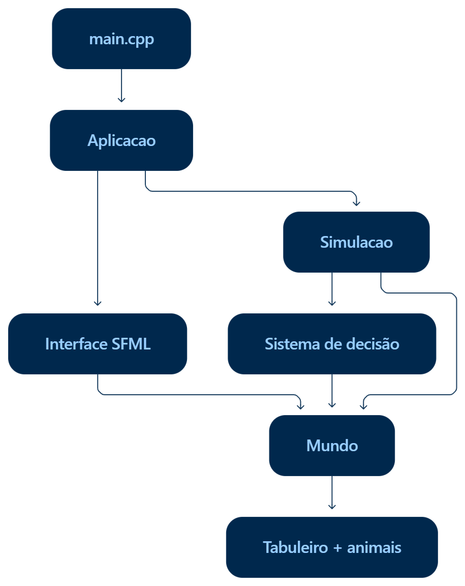

# Simulação Lobo e Coelho

Simulação de um ecossistema predador–presa em C++20 com visualização em [SFML 3](https://www.sfml-dev.org/). Coelhos comem plantas e fogem de lobos; lobos caçam coelhos e se alimentam das carcaças. Cada animal enxerga apenas um raio ao seu redor, decide sozinho o que fazer a cada passo de tempo (tick), e a população de cada espécie sobe e desce conforme a comida disponível.



## O que acontece na tela

O mundo é uma grade de 80 × 80 células, desenhada numa janela de 800 × 800 pixels. As bordas se conectam: um animal que sai pela direita reaparece na esquerda, e o mesmo vale para cima e para baixo.

| Cor | Significado |
|---|---|
| Verde escuro | Célula vazia |
| Verde claro | Planta |
| Branco | Coelho |
| Cinza | Lobo |
| Vermelho | Carcaça |
| Magenta | Inconsistência interna (uma célula aponta para um animal ou carcaça que não existe) |

Quando uma célula tem mais de uma coisa, a cor segue a prioridade animal > carcaça > planta.

A simulação roda a 10 ticks por segundo e a tela é atualizada a até 60 quadros por segundo. Para sair, feche a janela ou pressione **Esc**.

## Regras em resumo

- **Coelhos** comem plantas, são atraídos por elas e se afastam de lobos e carcaças. Reproduzem-se com frequência.
- **Lobos** atacam coelhos adjacentes, são atraídos por coelhos e carcaças e comem carcaças. Reproduzem-se raramente.
- Todo animal gasta energia a cada tick e ao se mover. Morre quando a energia acaba, quando passa da idade máxima ou quando é atacado.
- Um animal morto vira uma **carcaça**, que some depois de 50 ticks ou quando é comida.
- **Plantas** nascem aleatoriamente: cada célula tem 0,15% de chance por tick.

As regras completas, com todos os parâmetros e a lógica de decisão de cada espécie, estão em [docs/REGRAS.md](docs/REGRAS.md).

## Como compilar e executar

### Requisitos

- Windows com **Visual Studio** e a carga de trabalho "Desenvolvimento para desktop com C++". O projeto usa o toolset `v145` (Visual Studio 2026) e o padrão **C++20**.
- **SFML 3.x**. A interface usa a API nova do SFML 3 (`pollEvent` retornando `std::optional`, `sf::Keyboard::Scancode`), então o SFML 2.x não funciona.

### Instalando o SFML

O arquivo `.vcxproj` não referencia o SFML diretamente, então ele precisa vir de fora do projeto. O caminho mais simples é o [vcpkg](https://vcpkg.io/) com integração ao Visual Studio:

```bat
vcpkg install sfml:x64-windows
vcpkg integrate install
```

Depois disso, o Visual Studio encontra os cabeçalhos, as bibliotecas e as DLLs do SFML automaticamente em qualquer projeto.

Se preferir usar o SFML baixado do site oficial, configure no projeto (para a plataforma x64):

1. **C/C++ → Geral → Diretórios de Inclusão Adicionais:** a pasta `include` do SFML.
2. **Vinculador → Geral → Diretórios de Biblioteca Adicionais:** a pasta `lib` do SFML.
3. **Vinculador → Entrada → Dependências Adicionais:** `sfml-graphics.lib`, `sfml-window.lib` e `sfml-system.lib` (em Debug, as versões terminadas em `-d`).
4. Copie as DLLs da pasta `bin` do SFML para a pasta do executável.

### Executando

1. Abra `simulacao_lobo_coelho.slnx` no Visual Studio.
2. Escolha a configuração **Release | x64**. Em Debug a simulação fica bem mais lenta.
3. Compile e execute (F5 ou Ctrl+F5).

## Estrutura do repositório

```
simulacao_lobo_coelho/
├── src/
│   └── main.cpp              Ponto de entrada: cria e executa a Aplicacao
├── aplicacao/
│   ├── Aplicacao.h/.cpp      Loop principal: eventos, avanço do tempo e desenho
├── interface/
│   ├── Interface.h/.cpp      Janela SFML, teclado e desenho da grade
├── simulacao/
│   ├── Simulacao.h/.cpp      Ciclo de cada tick: mortes, decisões, conflitos e ações
│   └── SistemaDecisao.h/.cpp Comportamento de coelhos e lobos
└── dominio/
    ├── Tipos.h               Constantes de balanceamento e tipos básicos (Posicao, Acao...)
    ├── Animal.h/.cpp         Animal e Carcaca
    ├── Celula.h              Conteúdo de uma célula da grade
    ├── Tabuleiro.h/.cpp      Grade toroidal de células
    ├── SistemaVisao.h        Estruturas do campo de visão de um animal
    └── Mundo.h/.cpp          Estado completo: tabuleiro, animais, carcaças e plantas
```

Como as camadas se conectam, como um tick é processado e como o processamento paralelo funciona está explicado em [docs/ARQUITETURA.md](docs/ARQUITETURA.md).

## Ajustando a simulação

Quase todo o balanceamento fica em constantes no topo de [`dominio/Tipos.h`](simulacao_lobo_coelho/dominio/Tipos.h): energia, custos, idades e raios de visão de cada espécie. Outros pontos de ajuste:

| O quê | Onde |
|---|---|
| Tamanho da grade e das células | `linhas`, `colunas` e `tamanho_celula` em `aplicacao/Aplicacao.h` |
| Duração de um tick (padrão 0,1 s) | `tick_duracao` no construtor de `Simulacao` |
| Chance de nascer planta | `probabilidade_nascimento_planta` no construtor de `Simulacao` |
| Semente aleatória | `semente_base` em `simulacao/Simulacao.h` |
| Quantidade de animais a partir da qual o processamento é paralelo | `LIMIAR_PARALELO` em `simulacao/Simulacao.h` |
| Probabilidades de reproduzir, atacar e vagar | `simulacao/SistemaDecisao.cpp` |

## Documentação

- [docs/REGRAS.md](docs/REGRAS.md): regras do ecossistema, parâmetros e comportamento dos animais.
- [docs/ARQUITETURA.md](docs/ARQUITETURA.md): organização do código, ciclo do tick, controle de tempo e paralelismo.
